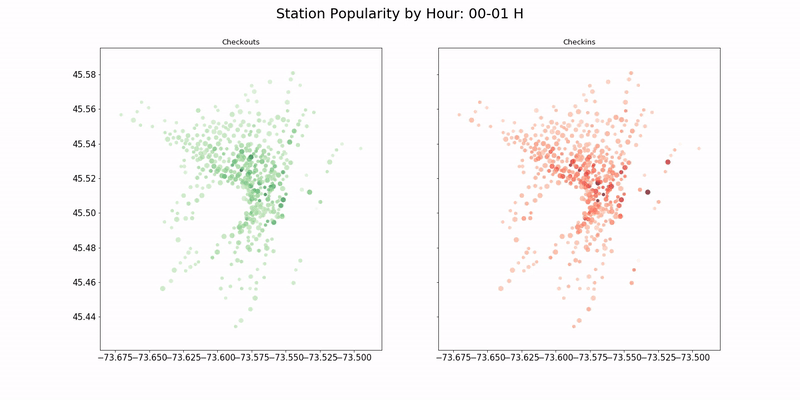

# Introduction
Repo to process and plot Montreal Bixi data

To get started, download and unzip the pre-organized data so that the .csvs are in the main directory.

Data Download: 
https://www.dropbox.com/s/000vvq6ck2ab5zp/data_zip.zip?dl=0

- Plotting and exploration available in bike.ipynb 
- launch_webpage.py will find directions through nearest available bixi stations 
- get_stations.py queries bixi website 

# Install Dependencies 
```
conda env create -f environment.yml -n bike_py27 
source activate bike_py27 
```

# Explore
Presentation on this work available here:
https://docs.google.com/presentation/d/1o5vMtLAqRZyFDDVCqUDl0y_NPa86FQCj7Fn4aLZiEO8/edit?usp=sharing

# Station Movement
+

